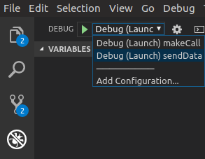

# jtapi-samples

## Overview

Sample Java programs demonstrating usage of the Cisco JTAPI API for call control.

Visit the [DevNet JTAPI Site](https://developer.cisco.com/site/jtapi)

## Available samples

- `makeCall` - basic make-call example.

- `sendData` - Opens a phone and performs a CiscoTerminal.sendData() request to send an [IP Phone Services](https://developer.cisco.com/site/ip-phone-services/) 'Hello World' message to the phone's display.

- `superProvider_deviceStateServer` - Demonstrates using CiscoProvider.createTerminal() to dynamically create a terminal by device name using the 'Superprovider' feature, then retrieves and monitors the device for device-side status changes using the 'Device State Server' feature.

- `dialViaOffice` - Implements a 'dial via office' senario, where a phone calls a CTI Route Point, which makes a new outbound call to a target DN, and then redirects both calls to a CTI Port which transfers the two calls together.

## Requirements

- [OpenJDK](https://openjdk.java.net/) 11

- [Apache Maven](https://maven.apache.org/) 3.6.3

- [Visual Studio Code](https://code.visualstudio.com/)

- A working Cisco Unified Communications Manager environment:

    - An CUCM application-user or end-user username/password, with the following roles:

        - `Standard CTI Allow Control of Phones supporting Connected Xfer and conf`

        - `Standard CTI Allow Control of Phones supporting Rollover Mode`

        - `Standard CTI Enabled`

        - `Standard CTI Allow Control of all Devices`

    - One (or two, to try all sample scenarios) [CTI suported phone devices](https://developer.cisco.com/site/jtapi/documents/cti-tapi-jtapi-supported-device-matrix/) (includes Cisco IP Communicator and Jabber soft phones), each configured with at least one directory number, each associated to the CUCM user.

        >Note, ensure at least one directory number has `Allow Control of Device from CTI` enabled

## Getting started

1. Make sure you have OpenJDK 11 installed, `java` is available in the path, and `$JAVA_HOME` points to the right directory:

    ```bash
    $ java -version
    openjdk 11.0.8 2020-07-14
    OpenJDK Runtime Environment (build 11.0.8+10-post-Ubuntu-0ubuntu120.04)
    OpenJDK 64-Bit Server VM (build 11.0.8+10-post-Ubuntu-0ubuntu120.04, mixed mode, sharing)
    ```

    ```bash
    $ echo $JAVA_HOME
    /usr/lib/jvm/java-1.11.0-openjdk-amd64
    ```

1. Open a terminal and use `git` to clone this repository:

    ```bash
    git clone https://github.com/CiscoDevNet/jtapi-samples.git
    ```

1. Open the Java project in [Visual Studio Code](https://code.visualstudio.com/):

    ```bash
    cd jtapi-samples
    code .
    ```

1. Edit rename `.env.example` to `.env`, and edit to specify environment variable config for the samples you wish to run.

1. Finally, to launch the sample in VS Code, select the **Run** panel, choose the desired `Launch...` option from the drop-down in the upper left, and click the green 'Start Debugging' arrow (or hit **F5**)

    

## Notes

1. In this project, the 11.5 version of the JTAPI Java libraries have been deployed to the local Maven repo in `lib/`.  If  you want to use a different version in the project:

    - Download and install the JTAPI plugin from CUCM (**Applications** / **Plugins**)

    - From this repository's root, use Maven to deploy the new version of `jtapi.jar` to the local repo.  You will need to identify the full path to the `jtapi.jar` installed above:

        ```bash
        mvn deploy:deploy-file -DgroupId=com.cisco.jtapi -DartifactId=jtapi -Dversion={version} -Durl=file:./lib -DrepositoryId=local-maven-repo -DupdateReleaseInfo=true -Dfile={/path/to/jtapi.jar}
        ```

        >Note: be sure to update {version} and {/path/to/jtapi.jar} in the command

    - Modify `pom.xml` to specify the new JTAPI version dependency.  Modify `<version>`:

        ```xml
        <dependency>
            <groupId>com.cisco.jtapi</groupId>
            <artifactId>jtapi</artifactId>
            <version>11.5</version>
        </dependency>
        ```

1. JTAPI configuration - e.g. trace log number/size/location and various timeouts - can be configured in `jtapi_config/jtapi.ini` (defined as a resource in `pom.xml`)